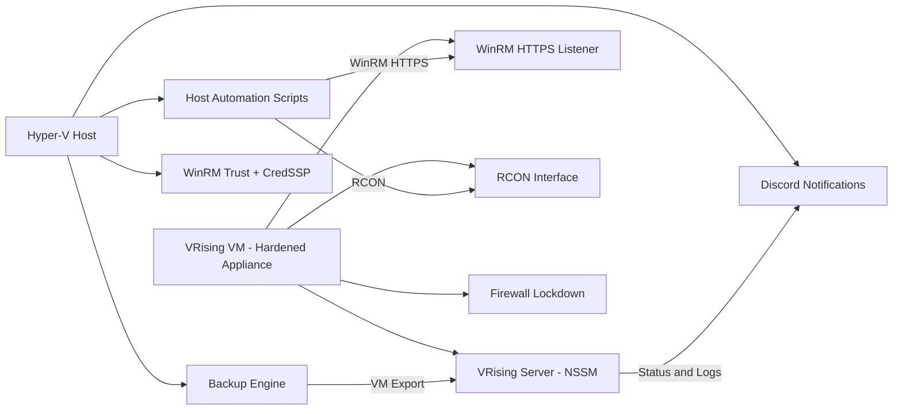
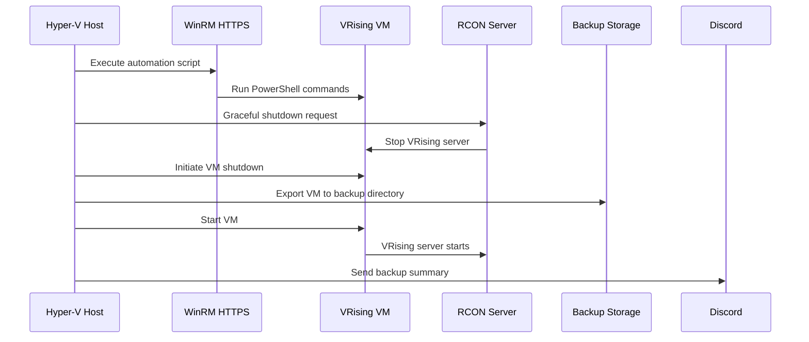
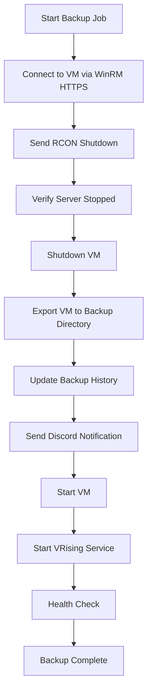
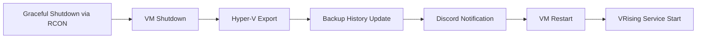

# 🧛‍♂️ VampireGuard — Architecture  
### A secure, automated, appliance‑style VRising server framework for Hyper‑V

VampireGuard uses a layered architecture that separates responsibilities between the Hyper‑V host and the VRising VM. This design ensures security, reliability, and deterministic automation while keeping the VM sealed and the host in full operational control.

---

# 1. High‑Level Architecture

VampireGuard is built on two cooperating layers:

- **Host Layer** — Orchestrates automation, backups, lifecycle, WinRM trust, and notifications.  
- **VM Layer** — Runs the VRising server inside a hardened Windows VM with minimal attack surface.

## 1.1 High‑Level Diagram

---

# 2. Component Overview

The components below are listed in the **canonical operational sequence**, matching the numbered script documentation.

---

## 2.1 Host Layer Components (01–04, 09)

### **01 — VM Configuration**
Ensures the VM is configured correctly for automation (checkpoints disabled, integration services validated, networking prepared).

### **02 — WinRM Setup (Host)**
Creates a certificate‑backed WinRM HTTPS listener, configures firewall rules, and prepares secure remote execution.

### **03 — WinRM Trust + CredSSP**
Imports the VM’s certificate, configures TrustedHosts, and enables secure credential delegation.

### **04 — VM Start**
Boots the VM and validates WinRM connectivity.

### **09 — Backup Engine**
Uses Hyper‑V VM export for atomic, corruption‑free backups with RCON‑based graceful shutdown.

---

## 2.2 VM Layer Components (05–08)

### **05 — VRising Dedicated Server Setup**
Installed via SteamCMD, prepares directory structure, and configures server files.

### **06 — VM Hardening**
Applies firewall lockdown, disables unnecessary services, configures Defender, and reduces attack surface.

### **07 — WinRM HTTPS Listener (VM)**
Certificate‑backed, firewall‑scoped, used for all remote automation.

### **08 — VRising Server Service**
Managed via NSSM, integrates RCON for graceful shutdowns and health checks.

---

# 3. Data Flow Architecture

---

# 4. Automation Lifecycle

---

# 5. Security Architecture

VampireGuard uses a layered security model designed to minimize attack surface while ensuring secure automation.

## 5.1 WinRM Security

- HTTPS listener with self‑signed certificate  
- Certificate stored in `LocalMachine\My`  
- Firewall restricted to host IP  
- No HTTP listener  
- CredSSP enabled for secure delegation  

## 5.2 VM Hardening

- Firewall rules locked to required ports  
- Unnecessary services disabled  
- Defender tuned for game server workloads  
- No SMBv1  
- No remote desktop exposure (optional)  

## 5.3 Host Security

- Certificate import and trust validation  
- Secure credential storage  
- No direct file access to VM internals  

---

# 6. Backup Architecture

Backups are designed to be:

- **Atomic** — Hyper‑V export ensures consistency  
- **Graceful** — RCON shutdown prevents world corruption  
- **Observable** — Discord notifications + history table  
- **Clean** — Automatic pruning of old backups  

---

# 7. Operational Model

VampireGuard is designed to behave like an appliance:

- The VM is sealed, hardened, and only controlled via WinRM/RCON.  
- The host performs all orchestration and automation.  
- Backups are safe to run unattended.  
- Scripts are deterministic and idempotent.  
- Logs and notifications provide full visibility.  

This model ensures predictable, repeatable, low‑maintenance operation.

---

# 8. Architecture Summary

VampireGuard’s architecture provides:

- A hardened VRising VM with minimal attack surface  
- Secure WinRM HTTPS communication  
- Graceful shutdown and startup via RCON  
- Automated, atomic VM exports for backups  
- Full observability through logs and Discord  
- A predictable, self‑maintaining server lifecycle  

This architecture ensures reliability, security, and operational confidence — the core goals of VampireGuard.
