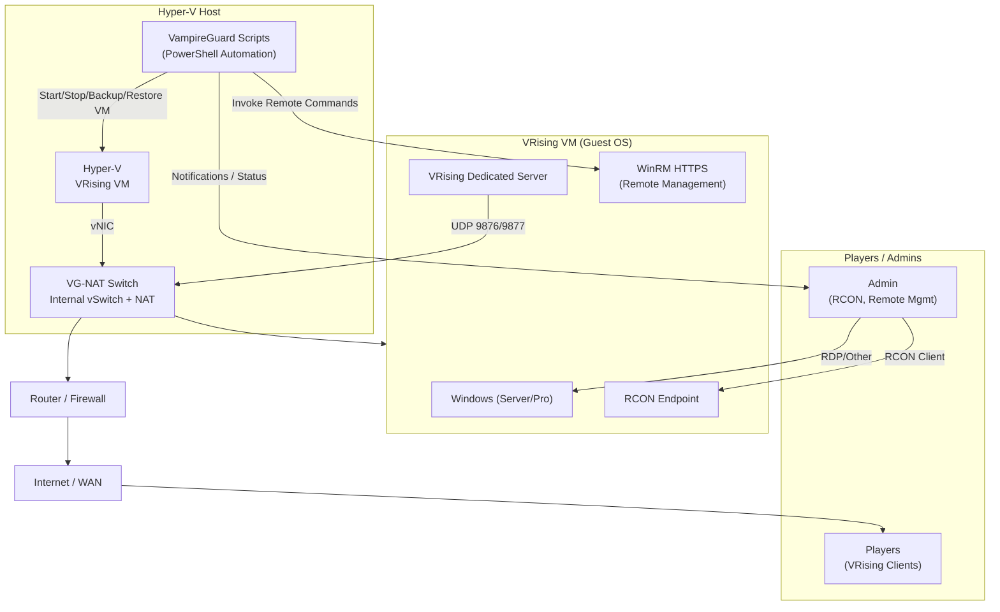

# Start‑Here Architecture Overview

This document provides a high‑level overview of the VampireGuard architecture and how the major components interact.  
It is intended to be the first file new operators read before diving into setup or automation details.

---

## 1. Components

### Hyper‑V Host
- Runs VampireGuard automation scripts  
- Hosts the VRising VM  
- Provides the VG‑NAT virtual switch  
- Handles NAT port mappings for external access  

### VRising VM
- Runs Windows (Server or Pro)  
- Hosts the VRising dedicated server  
- Exposes WinRM HTTPS for remote management  
- Exposes RCON for administrative control  

### Network Layer
- VG‑NAT internal network between host and VM  
- NAT mappings exposing VRising ports externally  
- Router/edge device forwards UDP 9876/9877 to the host  

### Players & Admins
- Players connect via VRising client  
- Admins connect via RCON or remote tools  
- VampireGuard orchestrates lifecycle, backups, and notifications  

---

## 2. Mermaid Architecture Diagram

---

## 3. How to Use This Document

This file should be the first stop for new operators.
From here, proceed to:

- `/docs/guides/nat-switch-setup.md`
- `/docs/guides/vm-creation.md`
- `/docs/guides/restore-guide.md`
- `/docs/guides/validation-checklist.md`
- Script‑specific documentation under `/docs/scripts/`

This overview provides the conceptual map needed to understand how VampireGuard orchestrates the entire VRising server lifecycle.