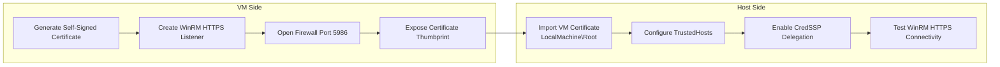
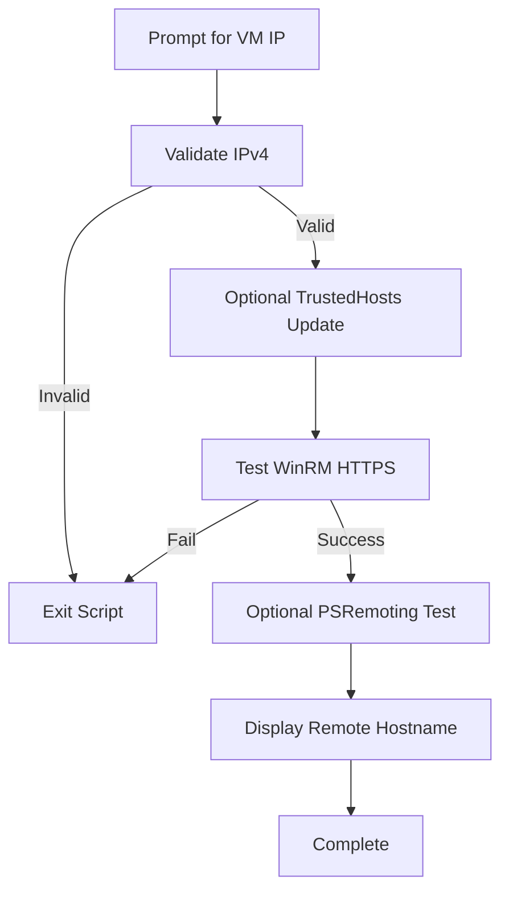

# VRising-Host-WinRMTrust.ps1 — WinRM HTTPS Validation & Trust Configuration

This script configures and validates secure WinRM over HTTPS connectivity from the Hyper-V host to a target VM. It provides interactive prompts, optional TrustedHosts updates, HTTPS listener validation, and optional PSRemoting tests using stored credentials.

## WinRM Trust Chain Diagram




---

## 1. Purpose

`VRising-Host-WinRMTrust.ps1` performs the following actions:

- Prompts the operator for the VM’s static IPv4 address
- Validates the IPv4 format
- Optionally updates the host’s WinRM `TrustedHosts` list
- Tests WinRM over HTTPS (`Test-WSMan -UseSSL`)
- Optionally tests PSRemoting using a stored credential XML file
- Provides timestamped, color-coded status output for clarity

This script is intended for **host-side validation** and is typically run after configuring WinRM HTTPS inside the VM.

---

## 2. Helper Functions

### 2.1 `Write-Status`

A utility function that prints timestamped, color-coded status messages.

- **Message** — text to display
- **Color** — console color (default: Gray)

Used throughout the script for consistent operator feedback.

### 2.2 `Validate-IPv4`

Validates IPv4 addresses using a regex pattern.

- Returns `true` for valid IPv4 format
- Returns `false` for invalid input

---

## 3. Step 1 — Prompt for VM IPv4 Address

The script:

1. Prompts the user for the VM’s static IPv4 address
2. Validates the format using `Validate-IPv4`
3. Exits if the format is invalid
4. Displays the accepted IP

**Example prompt:**
```
Enter the static IPv4 address of the VM (e.g., 192.168.0.199):
```

---

## 4. Step 2 — Optionally Update TrustedHosts

The function `Update-TrustedHosts`:

- Displays the current `TrustedHosts` value
- Asks whether to add the VM IP
- Prevents duplicate entries
- Updates the value using:

```powershell
Set-Item WSMan:\localhost\Client\TrustedHosts -Value <newValue> -Force
```

This step is optional and only needed when:

- DNS resolution is not used
- The VM is accessed by IP instead of hostname
- The environment requires explicit trust entries

---

## 5. Step 3 — Test WinRM HTTPS Connectivity

The function `Test-WinRMHttps`:

- Calls `Test-WSMan -UseSSL` against the VM IP
- Displays success or failure
- Returns `true` or `false`

**Example:**

```powershell
Test-WSMan -UseSSL -ComputerName $VmIp
```
Successful output confirms:

- The WinRM HTTPS listener is active
- The certificate is valid and trusted
- Firewall rules allow port 5986

If this test fails, PSRemoting is skipped automatically.

---

## 6. Step 4 — Optional PSRemoting Test (Stored Credential)

If WinRM HTTPS succeeds, the script optionally performs a PSRemoting test.

### 6.1 Credential Handling

- Prompts whether to test PSRemoting
- Uses a default credential path:

```
C:\Hyper V\KeyVault\HO-VR-HV01\PSRemoting.xml
```

- Allows the operator to override the path
- Imports credentials using:

```powershell
Import-Clixml -Path <CredentialPath>

## 6.2 PSRemoting Test

Runs:
```
Invoke-Command -ComputerName $VmIp -UseSSL -Credential $Cred -ScriptBlock { hostname }
```
If successful:

- Displays the remote hostname
- Confirms WinRM HTTPS + credential + remoting functionality

If it fails:

- Displays the error
- Indicates credential, trust, or listener issues

## 7. Final Output

At the end of execution, the script prints:
```
=== Host-side WinRM validation complete ===
```
---
## 8. Workflow Diagram


---

## 9. Troubleshooting

### Common Issues & Resolutions

- **[WinRM HTTPS fails](guide://action?prefill=Tell%20me%20more%20about%3A%20WinRM%20HTTPS%20fails)**  
  - Certificate not trusted  
  - Wrong certificate bound to port 5986  
  - Firewall rule missing  
  - Listener not configured  

- **[PSRemoting fails](guide://action?prefill=Tell%20me%20more%20about%3A%20PSRemoting%20fails)**  
  - Credential XML invalid or outdated  
  - Wrong username  
  - Password changed  
  - Authentication mismatch  

- **[TrustedHosts not updating](guide://action?prefill=Tell%20me%20more%20about%3A%20TrustedHosts%20not%20updating)**  
  - PowerShell not running as Administrator  

- **[Test-WSMan succeeds but Invoke-Command fails](guide://action?prefill=Tell%20me%20more%20about%3A%20Test-WSMan%20succeeds%20but%20Invoke-Command%20fails)**  
  - CredSSP disabled  
  - Authentication method mismatch  
  - Certificate CN mismatch  

---

## 10. Related Scripts

- **[VRising-VM-WinRMConfig.ps1](guide://action?prefill=Tell%20me%20more%20about%3A%20VRising-VM-WinRMConfig.ps1)** — VM-side WinRM HTTPS setup  
- **[VRising-Host-PSRemotingTest.ps1](guide://action?prefill=Tell%20me%20more%20about%3A%20VRising-Host-PSRemotingTest.ps1)** — standalone remoting validation  
- **[VRising-Host-NetworkCheck.ps1](guide://action?prefill=Tell%20me%20more%20about%3A%20VRising-Host-NetworkCheck.ps1)** — network diagnostics  
- **[VRising-Host-CredentialManager.ps1](guide://action?prefill=Tell%20me%20more%20about%3A%20VRising-Host-CredentialManager.ps1)** — credential XML creation  

---

## 11. Changelog

- **[v1.2](guide://action?prefill=Tell%20me%20more%20about%3A%20v1.2)**  
  - Added PSRemoting test  
  - Improved IPv4 validation  

- **[v1.1](guide://action?prefill=Tell%20me%20more%20about%3A%20v1.1)**  
  - Added TrustedHosts update logic  

- **[v1.0](guide://action?prefill=Tell%20me%20more%20about%3A%20v1.0)**  
  - Initial release  

---

## 12. Final Output

At the end of execution, the script prints:


